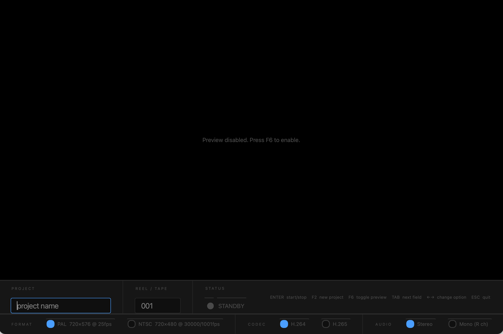

# Recording Machine



A fullscreen video capture application for archiving analogue media — VHS, 16mm film, 8mm film — via a USB video grabber. Designed to run on a Raspberry Pi with an always-on display.

## Hardware

- Raspberry Pi 500 (or similar)
- USB video grabber with composite (RCA) and S-Video inputs
- Monitor connected to the Pi

## Installation (Raspberry Pi)

```bash
git clone <this repo>
cd recording-machine
bash install-pi.sh
```

The script installs all dependencies, adds your user to the `video` and `audio` groups, and sets the app to launch automatically on login. Reboot after running it.

## Usage

The app opens fullscreen showing a live preview of the capture device.

### Controls

| Key | Action |
|-----|--------|
| `Enter` | Start / stop recording |
| `F2` | New project — clears project and reel fields |
| `F6` | Toggle camera preview on/off |
| `Tab` | Move to next field / option |
| `Shift+Tab` | Move to previous field / option |
| `Space` | Select the focused format/codec/audio option |
| `Esc` | Stop recording (if active), then quit |

### Fields

- **Project** — name for the current archiving project (e.g. `family_1985`)
- **Reel / Tape** — identifier for the current tape or reel (e.g. `001`, `side_a`). Automatically increments after each recording.

### Format settings (bottom bar)

| Setting | Options |
|---------|---------|
| Format | PAL 720×576 @ 25fps · NTSC 720×480 @ 30fps |
| Codec | H.264 · H.265 |
| Audio | Stereo · Mono (R ch) |

Use **Mono (R ch)** for 16mm film — the audio is on the right channel of the grabber and gets extracted to a single mono track.

### Status indicators

- **STANDBY** — live preview, ready to record
- **STARTING…** — launching the encoder
- **REC HH:MM:SS** — recording in progress with elapsed time
- **STOPPING…** — finalising the file
- **NO DEVICE** — capture device not found
- **LOW DISK SPACE** — less than 5 GB free on the output drive

### Output files

Recordings are saved to `~/Recordings/` as MP4 files named:

```
<project>_<reel>_<YYYYMMDD_HHMMSS>.mp4
```

## Configuration

All settings can be overridden with environment variables:

| Variable | Default | Description |
|----------|---------|-------------|
| `VIDEO_DEVICE` | `/dev/video0` | V4L2 device path |
| `AUDIO_DEVICE` | auto-detect | ALSA device string, e.g. `hw:2,0` |
| `OUTPUT_DIR` | `~/Recordings` | Directory for saved files |
| `DISK_WARN_GB` | `5` | Free space threshold for the low disk warning |
| `DEV_MODE` | `1` on macOS | Use webcam + skip audio (see Dev section) |

Example:

```bash
VIDEO_DEVICE=/dev/video1 OUTPUT_DIR=/mnt/nas/archive python3 main.py
```

### Checking devices

```bash
# List video devices
v4l2-ctl --list-devices

# List audio capture devices
arecord -l
```

If the grabber is not on `/dev/video0`, set `VIDEO_DEVICE` accordingly. If audio is not auto-detected, find the card/device numbers with `arecord -l` and set `AUDIO_DEVICE=hw:<card>,<device>`.

---

## Dev instructions

### Running on macOS

On macOS the app runs in **DEV_MODE** automatically. It uses the built-in webcam for preview and recording (no audio), so you can work on the UI without the Pi or grabber. Everything else — state machine, recording flow, file output — behaves the same.

```bash
pip install -r requirements.txt
python3 main.py
```

FFmpeg must be installed:

```bash
brew install ffmpeg
```

### Project structure

```
main.py              Entry point, cursor hiding, event filter setup
config.py            All tunables — formats, codecs, audio modes, paths
core/
  capture.py         CaptureThread (QThread) — OpenCV preview loop
  recorder.py        Recorder (QObject) — FFmpeg subprocess manager
  device.py          Device probing — video/audio detection, disk space
ui/
  main_window.py     MainWindow — state machine, keyboard handling, layout
  widgets.py         VideoFrame, RecordingBadge, FieldLabel
```

### Architecture notes

- **Preview vs recording**: On the Pi, FFmpeg owns the V4L2 device exclusively during recording. It outputs two simultaneous streams: raw BGR24 frames piped to stdout (for the live preview) and encoded H.264/H.265 to the MP4 file. On macOS, FFmpeg records independently while OpenCV keeps running for preview.
- **State machine**: `AppState` in `main_window.py` — `NO_DEVICE → PREVIEW → STARTING → RECORDING → STOPPING → PREVIEW`. The STARTING and STOPPING states run on a background `QThread` to avoid blocking the UI.
- **Audio auto-detection**: `probe_audio_device()` in `core/device.py` parses `arecord -l` looking for USB audio devices. Override with `AUDIO_DEVICE` if needed.
